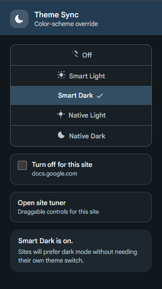
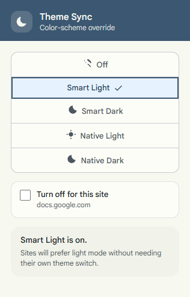
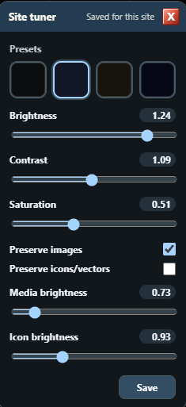
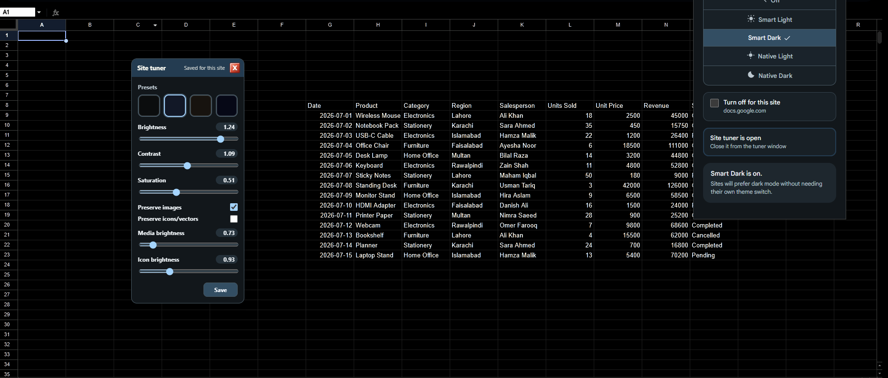

# Theme Sync

Theme Sync is a Chrome extension for making websites follow your preferred color theme with one click.

Pick light or dark once, and Theme Sync pushes that preference across the sites you visit so you do not have to hunt for each site's theme toggle manually.

Current version: `1.1.0`.

## What It Does

Theme Sync gives you one place to choose how the web should look:

- Off: let sites choose their own theme.
- Smart Light: make sites prefer light mode without Chrome warnings.
- Smart Dark: make sites prefer dark mode without Chrome warnings.
- Native Light: stronger light override for stubborn sites.
- Native Dark: stronger dark override for stubborn sites.
- Per-site off switch: remember sites where Theme Sync should not apply overrides.
- Site tuner: adjust supported sites with saved per-site dark backgrounds, media, icons/vectors, brightness, contrast, and saturation settings.
- Expanded coverage: supports more websites, including sites with custom theme implementations.

The goal is simple: one click, and compatible websites follow your preferred light or dark theme.

## Version 1.1.0

- Added per-site opt-out so a specific site can keep its own theme while the global mode stays on.
- Added a draggable Site Tuner for supported websites.
- Site Tuner settings are saved per site origin in extension storage, so changing one site does not affect another.
- Added dark background presets plus brightness, contrast, saturation, media brightness, and icon/vector brightness controls.
- Added separate controls to preserve or tune images and icons/vectors when a dark override makes site content difficult to see.
- The tuner opens only while a dark mode is active, includes an explicit Save button, and remembers its position and open/closed state per site.
- Added support for more websites with custom theme implementations, including sites that do not expose a standard dark-mode switch.

## Screenshots

### Main popup in dark mode



### Main popup in light mode



### Per-site Site Tuner



### Google Sheets with saved site tuning



## Site-specific controls

Theme Sync keeps global mode selection separate from site-specific preferences:

- Use **Turn off for this site** when a site should keep its own appearance. The choice is remembered for that site while the global mode remains enabled elsewhere.
- Use **Open site tuner** in a supported dark mode to adjust the site's background and content treatment.
- Choose a preset or tune the sliders, then press **Save**. Later saves update that site's stored settings.
- Close the tuner with its window-style close button. Closing it hides the controls without removing saved settings.

Settings are stored by site origin using Chrome extension storage. They do not change the settings for other sites.

## Privacy and Safety

Theme Sync is a visual customization tool. It changes page styling locally in the browser and stores theme preferences locally through Chrome extension storage.

Theme Sync does not:

- Collect, upload, sell, or share page content, credentials, browsing history, or personal data.
- Bypass logins, paywalls, DRM, or other access controls.
- Download or stream protected content.
- Modify website data or perform actions on a user's behalf.

The extension's page access is used only to apply the user's selected visual theme and site-specific styling preferences.

## Smart Mode

Smart Mode is the default no-warning mode. It tries several safe browser/page-level hints:

- Injects `color-scheme: light` or `color-scheme: dark`.
- Patches `window.matchMedia("(prefers-color-scheme: ...)")` in the page.
- Rewrites readable `@media (prefers-color-scheme: ...)` CSS rules.
- Watches for late-added styles and theme attributes.
- Adjusts common theme hints only when they already contain light/dark values.

Supported theme hints include:

- `data-mode`
- `data-theme`
- `data-color-mode`
- `data-color-scheme`
- `data-theme-mode`
- `data-bs-theme`
- `data-mui-color-scheme`
- `data-md-color-scheme`
- `data-scheme`
- `data-ui-theme`
- `data-app-theme`
- `data-site-theme`
- `color-mode`
- `color-scheme`
- `theme`
- `theme-mode`

Supported value/class pairs include:

- `dark` / `light`
- `dark-mode` / `light-mode`
- `mode-dark` / `mode-light`
- `theme-dark` / `theme-light`
- `dark-theme` / `light-theme`
- `darkmode` / `lightmode`
- `is-dark` / `is-light`
- `has-dark` / `has-light`
- `scheme-dark` / `scheme-light`
- `color-scheme-dark` / `color-scheme-light`

Theme Sync does not replace custom brand themes such as `data-theme="claude"` or `data-md-color-scheme="slate"` unless they are known light/dark tokens.

## Native Mode

Native Mode uses Chrome's debugger API and the Chrome DevTools Protocol command `Emulation.setEmulatedMedia`.

This is the most accurate way to override `prefers-color-scheme`, but Chrome may show:

```txt
"Theme Sync" started debugging this browser
```

That warning is Chrome behavior. Extensions cannot hide it from inside the extension.

If the warning is canceled or Chrome detaches the debugger, Theme Sync falls back to Smart Mode.

## Silent Native Mode

Power users can launch Chrome with:

```txt
--silent-debugger-extension-api
```

On Windows, this repo includes:

```bat
launch-chrome-silent-debugger.cmd
```

Close Chrome completely before using the launcher.

## Install Locally

1. Open `chrome://extensions`.
2. Enable Developer mode.
3. Click Load unpacked.
4. Select this project folder.
5. Pin Theme Sync from the extensions menu.

After code changes, click Reload on the extension card.

## Permissions

Theme Sync requests:

- `storage`: save the selected mode.
- `tabs`: apply the mode to already-open tabs.
- `scripting`: inject Smart Mode CSS and scripts.
- `debugger`: enable optional Native Mode.
- `<all_urls>`: apply the selected mode across normal websites.

## Limits

Smart Mode is silent but best-effort. Some sites use custom app state, server-side account settings, or protected cross-origin stylesheets.

Native Mode is stronger but can show Chrome's debugging warning unless Chrome is launched with the silent debugger flag.

Theme Sync does not try to click every site's theme toggle. That would require brittle per-site hacks.

## Development

There is no build step. The extension is plain Manifest V3 JavaScript.

Useful checks:

```sh
node --check background.js
node --check smart-mode.js
node --check page-smart-mode.js
node --check popup/popup.js
```

## License

MIT. See [LICENSE](LICENSE).
